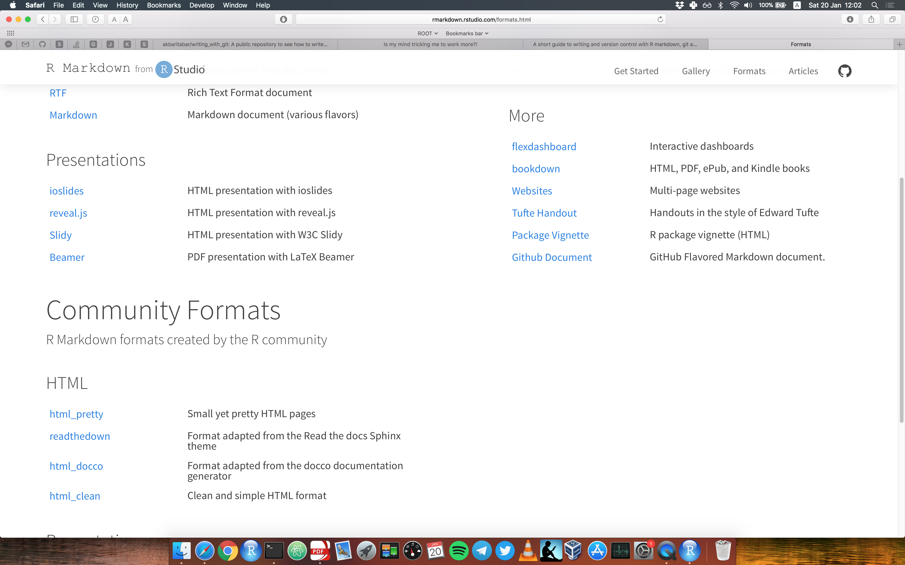

```{r setup, include=FALSE}
knitr::opts_chunk$set(echo = FALSE)
```

## 1st Video
- Trying to live an easier academic life!
- Version control with Git
- R Markdown links
    + Markdown in 20 min
    + Learn R markdown formats
- Git basic links
    + Learn Git
    + Github repository of this post

## 2ne Video
> - Clone our previous repository from Github! Why?
> - A real example of RMD with R code chunks and data analysis!
> - Turn a RMD report text into Presentation file!
> - Using git branches and stashing messy working directory!

## Further links
- Links to RMD presentation formats
- [Here](http://rmarkdown.rstudio.com/beamer_presentation_format.html)

## {.build .smaller}
